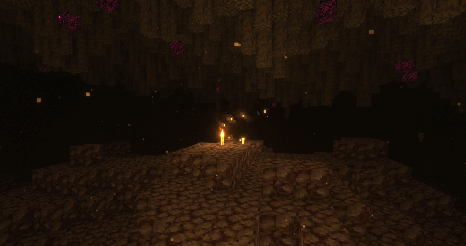

# Moon Generator
This is a spigot plugin that generates a moon like terrain.

## Terrain Features
###### Images rendered with [optifine](https://optifine.net/home) and [SEUS Renewed](https://www.sonicether.com/seus/)
### Surface

The rolling gravel hills under the dark starry sky shelter skeletons and ghasts. A wondering player may discover craters seething with brimstone.
### Craters

Immolating impacts pockmark the surface of the moon. Brave players may unearth ancient treasures nestled in the molten debris.
### Upper Caverns

Common resources can be found in abundance in these long winding passageways. Industrious players will quickly find their inventories stuffed when exploring this area.
### Lower Caverns

Basalt stalactites hang ominously above vast and open blackstone caverns. Obsidian tipped spikes seep strange purple liquid. Curious players may find what lies beneath the hot blackstone crust.
### Core

Daring miners who dig too deep will be overwhelmed by oppressive heat in the sweltering sauna that is the core. Only the most endurant miners will extract the riches of the molten depths.

## Recommended setup
This plugin should be used with [multiverse](https://www.curseforge.com/minecraft/bukkit-plugins/multiverse-core) to handle world creation and management. To create a new world with this generator, admins can use the following command.
```
/mv create moon NORMAL -g moon-generator
```

Additionally, Admins are encouraged to turn off weather and daylight tick, as well as setting the time to midnight. This will help the world feel more moon-like. While the admin is in the moon world, they can use the following commands.
```
/mvm set weather false
/gamerule doDaylightCycle
/time set midnight
```
### Using with [zone-commands](https://github.com/Yukiiro-Nite/zone-commands)
One can use the zone-commands plugin to allow players to get to the moon dimension by flying above the build limit. The following config would allow players to travel to and from the moon by moving above y = 300.
```yaml
zones:
  overworld-to-moon:
    type: boundry
    world: world
    condition: '{player.y} > 300'
    enter:
      tp:
        world: moon
        location:
          y: 300
        motion:
          y: '-{player.y}'
  moon-to-overworld:
    type: boundry
    world: moon
    condition: '{player.y} > 300'
    enter:
      tp:
        world: world
        location:
          y: 300
        motion:
          y: '-{player.y}'
```

### Config
You can use the config to control the spawning of craters.
```yaml
# Should craters be generated?
generate-craters: true
# 1 out of every chunks-per-crater chunks will generate a crater.
#  - Lower numbers mean more craters
#  - Higher numbers mean fewer craters
#  - As of V1.0.0, A chunks-per-crater that is too low may cause run-away generation
#    and will cause your server to time out.
chunks-per-crater: 512
```
